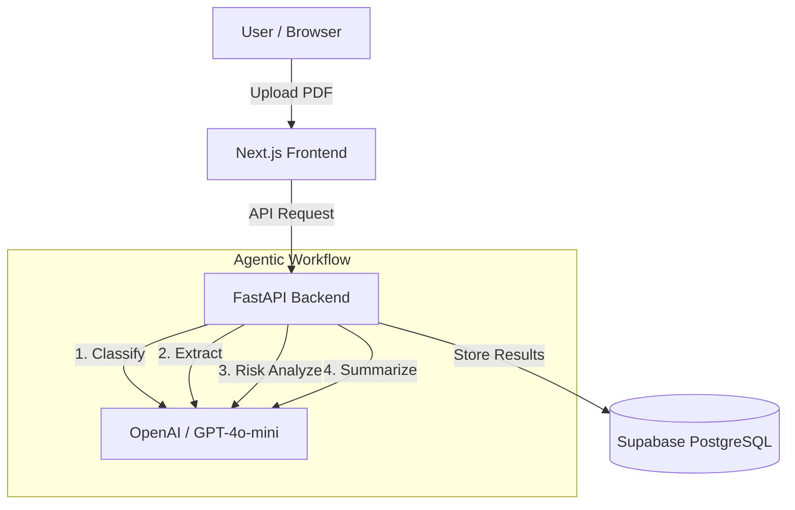

# LegalEase AI - Indian Legal Document Assistant ⚖️

Understand your contracts in Plain English. LegalEase AI is a hackathon-winning application that translates complex legalese into simple, easy-to-understand summaries.

**🚀 Live Demo:** [Insert Vercel Link Here]
**📺 3-Minute Video:** [Insert YouTube Link Here]

## ✨ Features
- **Instant Extraction**: Upload any PDF document (NDAs, Employment Contracts, Leases).
- **True Agentic Workflow**: Our backend doesn't just pass text to an LLM. It actively reasons through multiple steps: *Classifying -> Extracting Clauses -> Analyzing Risks -> Summarizing*.
- **Risk Scoring**: Know exactly what you are signing with a 1-10 overall risk score.
- **Plain English Explanations**: High-risk clauses are flagged and explained in standard English.

## 🏗️ Architecture



## 🚀 Future Enhancements (Post-Hackathon)
- **Large Document Processing (Map-Reduce)**: For contracts exceeding LLM context windows, implement a chunking algorithm to split the text, process chunks in parallel, and combine the extracted clauses dynamically.
- **Multilingual Support**: Support for regional Indian languages (Hindi, Tamil, etc.) using translation APIs.
- **OCR for Scanned PDFs**: Integrate Tesseract or AWS Textract to support non-searchable image-based PDFs.

## 🛠️ Tech Stack
- **Frontend**: Next.js 14, Tailwind CSS, Framer Motion, Lucide React
- **Backend**: FastAPI (Python), PyMuPDF (PDF Extraction)
- **AI Agent**: OpenAI API (GPT-4o-mini) with step-by-step reasoning
- **Database**: Supabase (PostgreSQL)
- **Deployment**: Vercel (Frontend), Render (Backend)

## 💻 Local Setup Instructions

### Prerequisites
- Node.js (v18+)
- Python (3.10+)
- OpenAI API Key

### Backend Setup
1. Open a terminal and navigate to the backend directory:
   ```bash
   cd backend
   ```
2. Create and activate a virtual environment:
   ```bash
   python -m venv venv
   source venv/Scripts/activate  # (Windows)
   # source venv/bin/activate    # (Mac/Linux)
   ```
3. Install dependencies:
   ```bash
   pip install -r requirements.txt
   ```
4. Set up environment variables:
   Rename `.env.example` to `.env` and add your OpenAI API Key.
   *(Note: The app defaults to Mock Mode if keys are omitted, allowing you to test the UI immediately!)*
5. Run the server:
   ```bash
   uvicorn main:app --port 8000 --reload
   ```

### Frontend Setup
1. Open a new terminal and navigate to the frontend directory:
   ```bash
   cd frontend
   ```
2. Install dependencies:
   ```bash
   npm install
   ```
3. Run the development server:
   ```bash
   npm run dev
   ```
4. Open [http://localhost:3000](http://localhost:3000) in your browser.

## 🌐 Deployment
This project is fully configured for deployment:
- **Backend**: Connect the repository to **Render** as a Web Service. It will automatically detect the `render.yaml` blueprint.
- **Frontend**: Connect the repository to **Vercel**. Set the `NEXT_PUBLIC_API_URL` environment variable to your Render backend URL.
